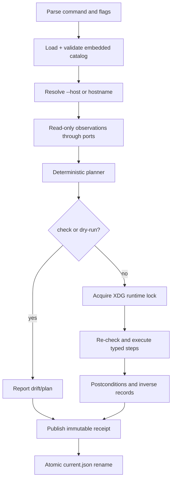
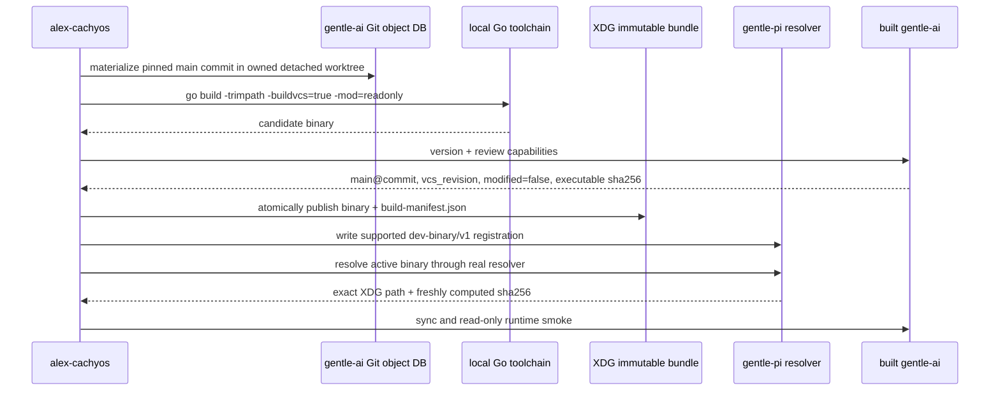

# Design — Reproducible Go configurator with a verified local-main Pi handoff

## 1. Decision summary

The new configurator is a root Go module built alongside the existing Bash tree. A validated, embedded YAML catalog is merged in the fixed order `global → role → host`, converted into a deterministic plan, and executed through typed runner, filesystem, Git, package, service, network, and elevation seams. Every run writes one immutable receipt and atomically advances a pointer index.

The existing `./apply`, `lib/`, `modules/`, `templates/`, `overlays/`, and `packaging/` paths remain authoritative until a later, explicit cutover. No migration step cleans, stashes, commits, resets, or force-checks out any worktree.

A fresh inspection of the local `gentle-pi` and `gentle-ai` repositories resolves the package-runtime gap more precisely than the earlier exploration:

- `gentle-pi` still provisions and strictly verifies its signed package-local Gentle AI `v2.4.0` bundle by default.
- `gentle-pi` now also has an explicit supported maintainer hook: `GENTLE_PI_GENTLE_AI_DEV_BINARY` or the persistent `~/.pi/gentle-ai/dev-binary.json` schema `gentle-pi.dev-binary/v1`. The resolver validates an absolute regular non-symlink executable, re-hashes it on every resolution, gives it precedence over the release pin, fails closed when the declaration is invalid, and surfaces the active path/version/digest.
- The configurator will therefore build the exact cataloged commit reachable from `gentle-ai`'s `origin/main` in an isolated worktree, publish the binary and a commit-bound SHA-256 manifest atomically under XDG data, register it through that supported persistent hook, and smoke the actual resolver. Catalog maintenance deliberately advances that commit as `main` advances; `apply --update` can report a candidate but cannot rewrite desired state. The configurator will not patch either source repository and will not pretend that cloning `main` is sufficient.
- Gentle Pi native review continues to call its own resolver. Every operational configurator-owned Gentle AI call—post-registration probes, `sync`, RDD enable/status, and later status checks—also resolves immediately through the selected `gentle-pi/main` resolver and executes the returned absolute path. Pre-registration build attestation uses only the staged candidate's known absolute path. Neither path consults ambient `PATH`.
- The signed `v2.4.0` package-local bundle remains installed and verified as a rollback fallback. A local `main` build has no upstream release signature, so the design does not fabricate one; its trust chain is the exact Git commit/tree, clean detached build input, Go module checksums, VCS build metadata, binary SHA-256, the configurator manifest, and the supported resolver.

## 2. Architecture and package boundaries

```text
cmd/alex-cachyos
        │
        ▼
internal/cli ────────► internal/app (use-case orchestration)
                           │
             ┌─────────────┼─────────────────────┐
             ▼             ▼                     ▼
     internal/catalog  internal/planner   internal/receipt
             │             │                     │
             ▼             ▼                     ▼
     internal/assets   internal/executor   internal/statepath
                           │
          ┌────────────────┼───────────────────────────────┐
          ▼                ▼               ▼               ▼
 internal/platform   internal/pi     internal/gitx   internal/adopt
          │                │               │               │
          └────────────────┴───────┬───────┴───────────────┘
                                   ▼
                         internal/runner ports
                    exec/fs/clock/host/network/elevation
```

### 2.1 Package responsibilities

| Package | Responsibility | Must not own |
|---|---|---|
| `cmd/alex-cachyos` | Process entrypoint and build metadata only | Catalog logic or system mutation |
| `internal/cli` | Parse subcommands and preserved flags; render human/JSON output | Direct file, Git, or command execution |
| `internal/app` | Run lifecycle: resolve paths/host, load, inspect, plan, lock, execute, receipt | Platform-specific command construction |
| `internal/catalog` | YAML decode, JSON Schema validation, typed validation, merge, normalization, pin validation | Host inspection or execution |
| `internal/assets` | `go:embed` catalog, schemas, templates, overlays, packaging, and Pi user-owned assets | Runtime repository-relative reads |
| `internal/planner` | Pure selection, dependency validation, stable ordering, plan digest, inverse descriptors | Calling the real OS |
| `internal/executor` | Re-check idempotency, enforce elevation/network policy, execute steps, collect outcomes | Ad-hoc shell strings |
| `internal/runner` | Typed command and filesystem ports plus production/fake implementations | Product ordering decisions |
| `internal/platform/cachyos` | Pacman/paru/systemd/GRUB/PAM/niri/Noctalia step factories and checks | Pi-specific state |
| `internal/pi` | npm pins, config rendering, local-main build handoff, resolver-selected absolute Gentle AI execution, managed-asset refresh/verification, RDD and override retirement | Reading auth files or credential values, or resolving `gentle-ai` from PATH |
| `internal/gitx` | Non-destructive checkout, object reads, tags, isolated worktrees, Git observations | Reset, clean, stash, commit, or force checkout |
| `internal/adopt` | One-time backups, ownership manifests, restore preconditions | Overwriting unknown backups |
| `internal/receipt` | Canonical receipt schema, write-once publication, atomic current index, inverse-plan loading | Authorization or review approval |
| `internal/statepath` | XDG path validation/defaults and owned-directory modes | Moving Pi's `~/.pi` state |

Dependencies point inward toward catalog/planner domain types. Platform, Pi, Git, and adoption packages implement ports consumed by `internal/app`; they do not import CLI code. This keeps fake-runner tests independent of CachyOS hardware.

### 2.2 Staged coexistence with Bash

The root receives `go.mod` and `go.sum`; the Bash entrypoint remains `./apply`. The Go entrypoint is `go run ./cmd/alex-cachyos` during development and an installed `alex-cachyos` binary after packaging. The Go work does not rename or wrap `./apply` in the first slice.

Go cannot embed files above its package directory. The transition therefore uses generated copies under `internal/assets/data/`:

```text
internal/assets/data/
  catalog/
  schemas/
  platform/templates/
  platform/overlays/
  platform/packaging/
  pi/
  source-manifest.json
```

`tools/sync-assets` copies only the declared Bash source paths into the embedded tree, normalizes no content, and writes a path/size/SHA-256 manifest. `go generate` performs refresh; `go run ./tools/sync-assets --check` fails when a copy differs. Bash continues reading the original paths, while Go reads only embedded copies. This temporary duplication is accepted to preserve the Bash fallback; cutover removes it only in a later change.

## 3. Catalog design

### 3.1 Files and schema

The authoring format is YAML because the desired state is reviewed by one maintainer and contains long structured inventories. Each document is decoded with unknown-field rejection, converted to JSON-compatible data, validated against embedded JSON Schema, and then validated as typed Go values.

```text
catalog/global.yaml
catalog/roles/workstation.yaml
catalog/hosts/galaxy.yaml
catalog/schema/catalog-v1.schema.json
```

Every file carries `catalogVersion: 1` and a `kind` (`Global`, `Role`, or `Host`). A host names zero or more roles; the initial `galaxy` host names `workstation`, whose content may initially be empty. Exactly one initial host is permitted by a repository-level validation test. Host resolution uses explicit `--host` first and hostname second; an unknown hostname fails before mutation with the known host names, and DMI, machine-id, `/etc/machine-info`, and other hardware identifiers are never catalog keys or fallback selectors.

Validation completes before planning or locking and rejects:

- unsupported schema versions and unknown fields/modules;
- duplicate IDs, route names, packages, targets, or dependency edges;
- missing embedded asset references and unknown template tokens;
- npm ranges (`^`, `~`, `>=`, `latest`, tags without exact versions), unpinned source checkouts/AUR-local sources/patches/remote artifacts, or a Pacman exact-artifact entry without an approved cache/archive source and SHA-256;
- non-40-hex checkout commits, a branch other than `main`, or a commit not verified reachable from fetched `origin/main` at update time;
- unsafe absolute destinations, relative checkout roots, secret-bearing fields, forbidden paths, and X11/unsupported-DE entries;
- missing checksums for remote artifacts and packaging patches; and
- dependency cycles or references to absent steps.

### 3.2 Deterministic merge rules

Omitted values mean “inherit”; explicit zero/false/empty values mean “override”. Decode-layer structs therefore use presence-aware fields rather than relying on Go zero values.

| Value kind | Merge rule |
|---|---|
| Scalar or enum | Later present value replaces earlier value |
| Object/map | Recursive merge by key; later present leaf wins |
| Module enable map | Merge by module name |
| Named records | Merge by stable `name`/`id`; duplicate definitions in one layer fail |
| Ordered lists | Replaced as a whole unless the schema defines a `ListPatch` |
| `ListPatch` | Apply `replace` first if present, then deterministic `remove`, then `add`; duplicate final identities fail |
| Model routes | Merge by route name, then require exactly the approved 23-name set |
| Commands/steps | Never text-merge; replace the complete typed step definition by ID |

After `global → each role in declared order → host`, normalization sorts semantically unordered sets by stable identity while preserving explicitly ordered sequences such as webapps and module steps. The normalized JSON form is hashed and becomes the catalog digest in plans and receipts.

### 3.3 Source-specific desired identities

Pinning is typed by source; the catalog does **not** impose exact versions on every Pacman/CachyOS package:

- npm: exact `npm:<name>@<semver>`; `pi-web-access@0.27.0`, `pi-commandcode-provider@1.2.3`, and `pi-mcp-adapter@2.6.0` are valid examples;
- Pacman/CachyOS repository packages: exact package names plus a declared repository and system transaction policy (initially the configured CachyOS/Arch repositories with full-system `-Syu --needed` semantics). Installed versions are resolved observations, not desired pins;
- optional exact Pacman artifact: exact package/version only when the catalog also names an approved package-cache or archive source and its SHA-256; this is a distinct `pacmanArtifact` type, never the default for rolling-repository packages;
- AUR/local build: exact source commit plus applicable `pkgver`/`pkgrel`, and exact source/patch identities with SHA-256 values;
- source checkout: canonical remote, branch `main`, exact 40-character commit, and expected tree hash once resolved;
- remote artifact: immutable URL or content identity plus SHA-256; and
- local path package: the literal `../../Projects/gentle-pi`, resolved relative to `~/.pi/agent/settings.json` and verified to equal `~/Projects/gentle-pi`.

The initial catalog population is invalid until every npm inventory entry has an approved exact semver and every source/artifact pin has its required commit or checksum. The design intentionally does not invent versions for packages whose exact current versions were not established by the approved artifacts. Runtime observations never rewrite desired state.

Normal platform convergence submits named packages only through the catalog's chosen full-system transaction policy. The plan records that policy and the transaction's version changes; it never performs an isolated implicit upgrade or downgrade. An exact Pacman artifact is checksum-verified before `pacman -U`, and the plan must explicitly classify its install as upgrade, downgrade, or same-version reinstall under the artifact policy; otherwise it blocks. Receipts record all resulting Pacman versions. This preserves rolling-repository practicality without allowing package state to move outside the selected system transaction.

### 3.4 Embedded rendering

Only `@HOME@` and `@USER@` tokens are supported. Rendering validates all tokens, destination policy, expected file mode, and final syntax before publication. JSON is canonicalized with stable key order and one trailing newline; TOML/KDL assets retain authored bytes except typed token substitution.

The embedded catalog includes its declared release name (for example `catalog-v1.0.0`) and digest. Repository validation proves that the annotated tag points to a commit containing matching bytes. The runtime receipt records both values without needing to mutate or inspect the active configurator worktree.

## 4. Deterministic planner and execution seams

### 4.1 Plan model

A plan is immutable after construction:

```text
Plan
  catalogDigest, host, selection, planDigest
  networkGroups[]
  steps[]
    id, module, description
    dependsOn[]
    scope: user|system
    network: none|required
    operation: typed operation name
    desired: redacted typed value
    observed: redacted typed value
    disposition: satisfied|apply|remove|blocked
    inverse: typed inverse descriptor
```

Topological sorting uses the declared module rank and then lexical step ID as stable tie-breakers. The invariants are `bootstrap` first, `verify` last, and `apps` before `desktop` when those modules are selected. A cycle or missing dependency fails before execution.

`--only` remains an exact selection override and does not silently add modules; omitted module dependencies become explicit preconditions checked against observed host state. `--with`/`--without` apply only when `--only` is absent, then profile defaults apply. This preserves the current CLI semantics while retaining graph validation.

Plan digests exclude timestamps, temporary paths, command output, and receipt IDs. Identical catalog, host, flags, and observations produce structurally identical plans.

### 4.2 Runner contract

No product package constructs shell command strings. The command seam uses an argv-only request:

```text
CommandRequest {
  executable: absolute path or allowlisted logical tool
  argv: []string
  cwd: absolute path
  env: explicit allowlist
  stdin: none or bounded generated bytes
  scope: user|system
  network: none|required
  outputPolicy: capture-redacted|discard|stream-safe
  timeout, outputLimit
}
```

`ExecRunner` resolves allowlisted tools, invokes with `shell=false`, applies time/output limits, and returns exit status plus sanitized output. `FakeRunner` matches requests by operation and argv, mutates an in-memory fixture state, and records every invocation. Tests can therefore assert exact commands, absence of `sudo`, idempotency, and network grouping.

Additional ports isolate:

- filesystem metadata/read/hash/atomic-write operations;
- clock and run-ID generation;
- hostname and current user;
- package inventories and service state;
- Git object/ref/worktree operations;
- network permission/availability; and
- elevation policy.

System commands are wrapped only by the elevation decorator as `/usr/bin/pkexec <absolute-command> <argv...>`. User operations never pass through it. Multi-file privileged publications use a hidden allowlisted self-helper mode: the normal process stages bytes, hashes them, and invokes the same binary through `pkexec` with a typed request. The root side re-validates destination allowlists, source regular-file status, hash, mode, and operation type before atomic rename. It accepts no general shell input. `sudo` is forbidden by construction and by a test scanning every real/fake command request.

### 4.3 Idempotency and network behavior

Every mutating step implements `Observe → Compare → Apply → Observe`. The executor re-observes immediately before mutation so a stale plan cannot overwrite a concurrent change. A satisfied step records `satisfied` and invokes no mutator.

Network classification is part of the step type, not inferred from command text. `--dry-run` performs local observations only, groups all `network: required` steps at the top, and executes none. `check` contains only non-mutating, network-free observations. `apply --update` may evaluate network-dependent update predicates and report newer `origin/main` candidates; normal `apply` uses the embedded desired state and selected Pacman transaction policy, requesting network only for planned repository transactions or missing artifacts. Neither command edits the catalog.

The process takes a user-scoped exclusive lock for mutating commands. `$XDG_RUNTIME_DIR` must be an absolute, user-owned, mode-safe runtime directory; if absent, `/run/user/<uid>` is accepted only after the same checks. There is no insecure `/tmp` fallback. Lock contention exits 75 before mutation.

## 5. Commands and data flow



The Go CLI exposes subcommands `apply`, `check`, `adopt`, `rollback`, `checkpoint`, and `receipt`. Compatibility flags remain available: `--host`, `--only`, `--with`, `--without`, `--remove`, `--dry-run`, `--check`, `--list`, and help. `--check` maps to non-mutating `check`; `--remove` maps selected module steps to their typed inverse/removal plan.

`check` ports the existing verification inventory: niri/Noctalia validation, embedded-byte comparisons, package presence/versions, greetd/boot/PAM, failed units, `pacman -Dk/-Qk`, `.pacnew`, service state, and warn-only `fprintd-list` presence. It reports each managed-file drift with its known backup path. It never reads fingerprint storage.

## 6. Receipts, drift, and inverse plans

### 6.1 XDG layout

```text
$XDG_STATE_HOME/alex-cachyos/                 # default ~/.local/state/alex-cachyos
  receipts/<UTC>-<runHash12>.json
  current.json
  adoptions/<targetHash>.json
  worktrees/<owned-run-id>/                   # only isolated, tool-owned worktrees

$XDG_DATA_HOME/alex-cachyos/                  # default ~/.local/share/alex-cachyos
  gentle-ai/main/<commit>/gentle-ai
  gentle-ai/main/<commit>/build-manifest.json

$XDG_CACHE_HOME/alex-cachyos/                 # default ~/.cache/alex-cachyos
  downloads/ and verified package artifacts

$XDG_RUNTIME_DIR/alex-cachyos-<uid>.lock
```

Pi's own `~/.pi` paths are neither moved nor treated as XDG-compliant.

### 6.2 Receipt schema

Each receipt is canonical JSON with schema `alex-cachyos.receipt/v1`:

```text
schema, runId, command, startedAt, finishedAt, status, noChange
host { requested, resolved, hostname }
catalog { catalogVersion, release, tag, digest, source }
selection { only, with, without, remove, update, dryRun }
plan { digest, networkRequired[] }
steps[] { id, module, scope, network, disposition, outcome, timing, errorCode }
managedFiles[] { path, beforeHash, afterHash, mode, backup, ownership }
mutations[] { kind, target, before, after, inverse, rollbackPrecondition }
desiredPackages { pacmanNames, pacmanRepositoryPolicy, pacmanTransactionPolicy }
desiredExactPins { npm, sourceCheckouts, aurLocalSources, patches,
                   remoteArtifacts, optionalPacmanArtifacts }
resolvedInstalledVersions { pacman, aur, npm }
systemTransactions[] { manager, policy, requestedNames, versionChanges }
checkouts[] { repo, branch, desiredCommit, beforeCommit, resolvedCommit,
              dirty, dirtyCounts, adopted, cloned, skipped }
piRuntime { gentlePiCommit, gentleAiCommit, activePath, version,
            binarySha256, buildManifestSha256, resolverSource,
            signedFallbackVersion, signedFallbackManifestSha256 }
gentleAiInvocations[] { operation, absolutePath, binarySha256, resolverSource }
managedAssets { manifestPath, manifestSha256, verifiedEntries[] }
reviewMode { effective, deciding }
credentials { referencedNames[] }
warnings[], errors[]
rollbackOf, reappliedCatalogTag
```

Normal Pacman packages appear under `desiredPackages`, not `desiredExactPins`; only an explicitly cataloged and checksum-verified `pacmanArtifact` appears in the latter. `check` compares normal Pacman state by exact package-name presence, explicit ownership, and repository/transaction policy, while recording installed versions as resolved evidence. It does not call a rolling-repository version difference desired-state drift.

Dirty summaries are counts by porcelain status class only. Command output is not persisted unless a field-specific parser converts it into an allowlisted value. Receipts contain no argv that may hold a secret, no environment values, no diffs, no auth state, and no biometric content.

### 6.3 Atomic publication

The writer creates the receipt directory as 0700, writes a same-directory temporary file as 0600, fsyncs the file, renames with a no-replace/write-once check, and fsyncs the directory. Existing receipt names are never opened for writing. Automatic retention or cleanup is out of scope.

`current.json` is a small pointer document containing schema, run ID, relative receipt path, and receipt SHA-256. It is written/fsynced to a temporary sibling and atomically renamed, so readers see the old or new complete pointer. A failed run still receives a receipt and becomes current after its receipt is durably published. If receipt publication fails, the command reports failure and never claims an audit record exists.

### 6.4 Drift and rollback

The catalog remains desired-state authority. The current receipt supplies last-observed hashes and inverse information. `check` classifies differences as:

- desired-state drift: live state differs from the current catalog;
- post-apply drift: live state differs from the receipt's recorded after-state;
- unmanaged conflict: a desired path exists without configurator ownership; or
- unknown: the state cannot be safely observed.

Rollback executes a new plan; it never edits an old receipt. Every inverse has a precondition, normally “live hash equals the recorded after hash.” If a user edited a managed file after apply, rollback refuses rather than overwriting it. Files created by the tool are removed only when their live hash still matches; adopted files restore the recorded one-time backup. System-wide package/desktop recovery remains Snapper-owned and is reported rather than reimplemented.

## 7. Adoption, backups, and Git safety

### 7.1 File adoption

Before first management of an existing ordinary file, `adopt` creates `<target>.bak.alex-cachyos` exactly once with exclusive creation, preserved metadata, fsync, and a SHA-256. An immutable adoption record binds target, backup, original hash/metadata, and first receipt. A pre-existing backup without a matching valid adoption record is ambiguous and blocks adoption; the tool never overwrites or guesses ownership.

If the target did not exist, ownership records `created`; rollback removes it only under the expected-after-hash precondition. Package-owned files use package restore semantics rather than pretending the backup is package authority.

An unmanaged existing `~/.pi/web-search.json` is treated as potentially secret-bearing: the configurator uses metadata-only existence checks, does not open or back it up, and blocks with instructions to replace credentials with references manually. Once the configurator has created the known secret-free file and recorded ownership, checks may compare its SHA-256 to the embedded expected bytes without parsing or logging content.

### 7.2 Harness checkout algorithm

Catalog entries pin canonical remote, branch `main`, and a 40-character commit verified reachable from `origin/main`. This is a point-in-time reproducible selection of the development channel, not a release-channel substitution. `apply --update` fetches `origin/main` and may report its exact newer candidate commit, but it does not move a checkout past the catalog commit, rewrite embedded bytes, create a checkpoint, or otherwise change desired state.

Advancement is a deliberate catalog-authoring workflow: fetch `origin/main`, select and review the exact reachable candidate for each checkout, update the catalog commit/tree and generated source manifest, run catalog/build/resolver fixtures, commit the catalog change, and create the next annotated `catalog-v*` checkpoint. Only that reviewed snapshot becomes consumable desired state. Stable and RC tags remain evidence only.

For each `~/Projects/gentle-{ai,pi}` checkout:

1. If absent, clone without force and check out local `main` at the pinned commit.
2. If present, verify it is a Git repository with the expected canonical remote; otherwise block.
3. Fetch remote refs without pruning user refs or moving tags by force.
4. Read `git status --porcelain=v1 -z`; retain counts only.
5. Verify the pin is reachable from fetched `origin/main`.
6. Compute paths changed from current `HEAD` to the pin and intersect them with local modified/untracked paths. On overlap, abort the step, preserve bytes, and record `dirty: true`, `skipped: true` with an actionable message.
7. Use plain `git checkout main`, then `git merge --ff-only <pin>` when advancement is needed. Diverged local branches block. No detached active checkout, reset, clean, stash, commit, or force operation is allowed.
8. Record exact before/after `HEAD` and dirty counts.

A dirty tree already at the desired commit remains untouched. It cannot be considered a reproducible source for installation if the runtime would load modified files; `gentle-pi` convergence therefore blocks until its checkout is clean. The `gentle-ai` binary build uses a separate exact-commit worktree, so a dirty active clone is never compiled accidentally.

Harness clones are direct Git checkouts, never Pi `git:` packages.

### 7.3 Configurator tags and prior catalogs

`checkpoint create --tag catalog-vX.Y.Z -m ...` locates the configurator Git repository, validates that catalog/assets are committed at `HEAD`, and creates an annotated tag. It may coexist with unrelated dirty files but never commits them. Existing tags refuse movement unless the operator explicitly uses the separate force-capable Git operation outside normal apply; ordinary configurator paths never emit force.

Prior catalog reads use `git show`/`git cat-file`. If the current binary cannot support the prior schema/assets, a detached isolated worktree is created under configurator-owned XDG state and the tagged version is built/run there. The active worktree is never checked out. Cleanup removes only a worktree carrying the configurator's ownership marker and no unexpected modifications; otherwise it is left for inspection.

## 8. Local-main Gentle AI runtime handoff

### 8.1 Local source evidence and chosen hook

The local `gentle-pi` sources establish these contracts:

- `scripts/gentle-ai-installer.mjs` pins `INSTALLER_VERSION = "2.4.0"`, publishes a real-directory version bundle with an integrity manifest, and uses lock/tombstone/rename recovery.
- `lib/gentle-ai-binary.ts` rejects invalid package-local bundles and ambient PATH/sibling/symlink fallbacks.
- The same file explicitly supports a dev-binary override via an environment variable or `gentle-pi.dev-binary/v1` registration, validates and re-hashes it on each resolution, and never silently falls back when a declaration is invalid.
- `/gentle:dev-binary` and diagnostic surfaces expose that hook as an unpinned maintainer field-test lane.

The local `gentle-ai` sources establish that a source build defaults to version `dev`, embeds VCS build settings, exposes revision/modified status and executable SHA-256 through review capabilities, and refreshes its managed assets through its `sync` command. Operational invocation of that command still follows §8.3.

Because a supported hook exists, no patch or source mutation is designed. The configurator adds pinning around the hook rather than weakening the package's signed release verifier.

### 8.2 Build and publication sequence



Detailed behavior:

1. Require the exact catalog commit to be reachable from `origin/main`.
2. Create a detached, tool-owned worktree at that commit; reject submodules unless explicitly cataloged and pinned.
3. Require the local Go version declared by `go.mod`; use `GOTOOLCHAIN=local`, `GOWORK=off`, `-mod=readonly`, `-trimpath`, and VCS metadata. Build with `main.version=main@<commit12>` so the binary does not claim the stable `2.4.0` identity.
4. Verify `go version -m`, then invoke the staged candidate's known absolute path for `version` and `review capabilities`: VCS revision equals the full desired commit, `vcs.modified=false`, the executable is a regular non-symlink file, and self-reported SHA-256 matches an independently computed digest.
5. Write `alex-cachyos.gentle-ai-main-build/v1` containing canonical remote, branch, commit, tree, Go version, GOOS/GOARCH/CGO, normalized build flags, binary SHA-256, capabilities/build ID, and build time. Build time is audit metadata, not part of the binary identity.
6. Publish to `$XDG_DATA_HOME/alex-cachyos/gentle-ai/main/<commit>/` by staged fsync and atomic rename. Existing matching bundles are reused; existing mismatching bundles block and are never overwritten in place.
7. Run `pnpm install --frozen-lockfile` in the clean pinned `gentle-pi` checkout with normal postinstall semantics. Do not set `GENTLE_PI_SKIP_GENTLE_AI_INSTALL=1`; this preserves and verifies the signed `v2.4.0` fallback.
8. Atomically install the strict registration `{"schema":"gentle-pi.dev-binary/v1","path":"<absolute immutable binary>"}` at `~/.pi/gentle-ai/dev-binary.json`, using the normal adoption contract if an existing configurator-owned registration is replaced. An unknown user registration blocks rather than being overwritten.
9. Invoke the selected `gentle-pi` resolver implementation in a bounded Node adapter and require it to return the exact registered path and digest. Then execute that absolute path for version/capabilities/status probes. A checkout without this completed handoff is reported as non-converged.
10. Resolve again immediately before invoking the absolute binary with `sync`, then refresh Pi agents/chains/support from the selected `gentle-pi/main` checkout and verify `managed-assets.json` entry-by-entry.

The bounded Node adapter imports only the selected checkout's exported `resolveGentleAiBinary`/dev-registration and `installSddAssets` surfaces, receives fixed operation names and absolute paths, and returns JSON with path/digest/source/counts. It cannot execute arbitrary module names or read auth files. A conflicting ambient `GENTLE_PI_GENTLE_AI_DEV_BINARY` is allowed only when it resolves to the same cataloged path and digest; otherwise convergence/check blocks so a session override cannot make Pi and configurator operations disagree. If the exports disappear, the adapter fails closed and the design must be revisited; it does not fall back to PATH, a sibling/global binary, or copied captured assets.

### 8.3 Resolver-selected execution contract

`internal/pi` owns one `GentleAiExecutableResolver` port. Its production implementation calls the selected `gentle-pi/main` adapter immediately before **every operational** configurator-owned Gentle AI process and returns `{absolutePath, sha256, source}`. In normal convergence the executor requires an absolute regular non-symlink path, the cataloged main-bundle path and digest, and an allowed resolver source (`registration`, or a same-path environment override); it then passes that absolute path directly as `CommandRequest.executable`. No call uses the logical executable name `gentle-ai`, `exec.LookPath`, a shell, or a PATH lookup. Pre-registration attestation may execute the staged candidate by its already known absolute path, but no RDD, sync, status, or native-review operation may do so before resolver registration succeeds.

This contract covers post-registration capability/version probes, `sync`, `review mode enable`, `review mode status`, override-retirement sync/status probes, and all later configurator status commands. A rollback operation may explicitly switch its expected authority to the verified signed fallback only after removing/restoring the registration; it still resolves that fallback through the same Gentle Pi resolver before execution. Gentle Pi native review is not redirected by the configurator: it keeps calling its production `resolveGentleAiBinary`, which observes the same persistent registration. Resolver path/source/digest are recorded for each invocation, and any mismatch fails closed before the command runs.

No user-shell wrapper or link is installed in the first slice. If shell convenience is added later, it must be a configurator-owned, atomically updated wrapper/link that delegates to the currently registered absolute binary and is drift-checked separately. It can never replace the registration or become Gentle Pi/native-review authority; ambient PATH remains irrelevant to native review.

### 8.4 Integrity tradeoff and rollback

The stable bundle retains release signature, archive SHA-256, executable SHA-256, and canonical package manifest verification. There is no signed upstream release artifact for an arbitrary `main` commit, so the local build cannot honestly preserve a release signature. Instead, it adds exact source and build provenance plus SHA-256 and uses the official unpinned hook under configurator control. This favors the approved development channel over release-signer authenticity.

If cryptographic signer authenticity becomes mandatory, the correct behavior is to block until upstream supplies a signed-main artifact or signed local-source installer contract—not to mint a local “upstream” signature.

Rollback removes/restores only the configurator-owned registration after a hash precondition, verifies that the signed package-local `v2.4.0` bundle still passes the native resolver, and records the runtime authority change in a rollback receipt. Source checkouts and their dirty state are not rewound destructively.

## 9. Pi packages, configuration, and generated assets

### 9.1 Package convergence

The catalog contains exact npm specs for the full approved inventory: `pi-commandcode-provider`, `pi-subagents-j0k3r`, `@juicesharp/rpiv-ask-user-question`, `pi-web-access`, `@juicesharp/rpiv-todo`, `pi-btw`, `pi-mcp-adapter`, `gentle-engram`, and `pi-antigravity`, plus local `../../Projects/gentle-pi`. Validation rejects the catalog until every npm entry is exact.

The configurator drives user-scope installs from this list; `pi update --all` is not convergence. `check` asks `pi list` and probes both `~/.pi/agent/npm` and the observed legacy `~/.pi/npm` layout, recording which layout the installed Pi uses. Desired specs and resolved installed versions remain separate.

### 9.2 User-owned rendering

A single typed Pi configuration model renders:

- minimal `~/.pi/agent/settings.json` with default model/provider/thinking/theme, exact package list, and only the approved runtime marker policy;
- `~/.pi/agent/subagents.json` with `session_resources: lean`, `default_mode: task`, `enable_continue: false`, `debug: false`, and 23 `{model, effort}` profiles;
- `~/.pi/gentle-ai/models.json` with the same 23 names and `{model, thinking}`;
- persona and background-subagent JSON;
- `~/.pi/agent/AGENTS.md` containing user environment guidance;
- secret-reference web configuration; and
- the temporary `subagents/sdd-research.md` override.

The 23 route names are an enum-like required set in typed validation. They are authored once as `{name, model, level}`. Two pure renderers produce canonical JSON, and cross-file tests compare every name/model/level.

The changelog marker is runtime-owned metadata rather than a stale desired pin. The renderer preserves a syntactically valid existing marker or derives the fresh value from the pinned Pi runtime on first install; it is recorded as resolved metadata and excluded from desired-state drift. No unrelated settings keys survive because the approved file shape is minimal.

`AGENTS.md` is adopted/rendered as user-owned. The configurator never writes or merges user text into `APPEND_SYSTEM.md`; the active Gentle AI/Pi install and sync paths regenerate that package-managed file, and verification checks the expected package markers and manifest ownership.

### 9.3 Managed asset refresh

The selected `gentle-pi/main` checkout is the source for Pi agents, chains, support files, and `managed-assets.json`. The bounded adapter calls its existing managed-asset installer. Force refresh replaces only content whose current hash proves package ownership; user-modified content is skipped and removed from managed ownership, matching the local implementation. Captured-machine assets are never copied into the repository.

After refresh, verification parses the manifest schema, rejects unsafe paths/duplicates/non-SHA values, hashes each regular non-symlink target, and requires equality. The receipt records path/hash pairs and the manifest hash, not file contents. The resolver-selected absolute main binary's `sync` command separately refreshes assets embedded by that active binary.

## 10. RDD, web research, auth, and temporary override

### 10.1 RDD

After the active runtime smoke, the executor resolves through the selected Gentle Pi resolver immediately before each call and runs:

```text
<resolver-selected-absolute-path> review mode enable --scope global --cwd <declared-repo>
<resolver-selected-absolute-path> review mode status --cwd <declared-repo>
```

The parsed status must be `effective:on` and `deciding:global`; each call must record the same cataloged path and digest. `check` resolves again and repeats only status. Prior state is recorded through the status API, not by opening its backing file, so rollback can restore the prior global choice with the public mode command. A disabled result remains truthful `disabled/unmanaged`; no approval or delivery authority is inferred from configurator receipts.

### 10.2 Secret-reference web configuration

The catalog permits credential references only as `$NAME`, `${NAME}`, or a catalog-approved trusted command beginning `!` with an absolute executable. It rejects literal credential fields and records referenced names only. The rendered file is mode 0600. Trusted-command sources remain a same-user trust boundary and are not treated as sandboxed.

Interactive Codex/Kimi login, browser-cookie opt-in, OAuth, and future providers remain post-apply instructions. Authentication checks invoke documented status/capability probes, retain only an enum such as `available|missing|unknown`, and discard output not explicitly allowlisted. `auth.json`, keyrings, MCP credential files, caches, and session files are never opened.

### 10.3 Pi-specific `sdd-research` retirement

The installed override has the exact specified model, thinking level, tool list, schemas, and grant text. The local packaged `gentle-pi/assets/agents/sdd-research.md` currently has no web tools and declares empty evidence grants, so it does not satisfy retirement.

`apply --update` evaluates `pi-sdd-research-web-capable` as an all-of predicate:

1. GitHub issue status for `gentle-ai#3846` and `gentle-pi#471` is closed/completed, recorded with retrieval time and URLs.
2. The consumed exact `gentle-pi/main` commit contains its packaged `sdd-research` agent.
3. A strict parser finds `web_search`, `source_check`, `fetch_content`, and `get_search_content`, or an explicitly cataloged one-to-one Pi equivalent for each.
4. The package contract declares non-empty `documentation` grants containing `fetch_content` and non-empty `open-web` grants containing all four web capabilities.
5. The installed package agent hash matches `managed-assets.json`.
6. A documented no-model Pi registration harness in an isolated agent home proves the packaged agent is discoverable, the four web tools are actually registered by Pi, and the production Gentle Pi admission path grants them to `sdd-research` without the user override.

The isolated harness is not a frontmatter-only check. It creates private `HOME`/XDG/Pi directories, writes a minimal settings file containing the catalog-exact `pi-web-access` package plus the selected local `../../Projects/gentle-pi` package, installs or materializes that exact package/extension set, and installs the candidate packaged agents through the selected Gentle Pi asset installer. It then starts the real Pi extension loader with a bounded verifier extension. On `session_start`, the verifier reads `pi.getAllTools()`, requires registered tool identities for `web_search`, `source_check`, `fetch_content`, and `get_search_content` (or the cataloged one-to-one equivalents), asks the production Gentle Pi agent/admission loader for the effective `sdd-research` tool set, requires all four in the admitted intersection, writes a canonical JSON result, and exits before any model request. The result records package specs/commits and tool source metadata so merely listing names in agent frontmatter cannot pass. Missing extension installation, loader failure, duplicate/renamed tools, or absent admission is false.

Issue status alone, a generic Gentle AI version (including v2.5), prose saying research is supported, a frontmatter allowlist without runtime registration, or a non-empty but incomplete tool list is false.

Retirement is transactional. While the override still exists, the executor first provisions and passes that isolated harness. It then backs up the configurator-owned override reference in the inverse plan, removes the live override, invokes resolver-selected absolute `sync`, refreshes Gentle Pi assets, verifies the manifest, and repeats the same registration/admission assertions against the real agent home with the catalog package set already installed. Any failure restores the override atomically and records a failed retirement. Offline `check` does not query GitHub; it uses the last receipt's issue observation plus current local evidence and reports `unknown` when freshness is unavailable.

## 11. CachyOS platform mapping

Each current Bash module becomes a module factory producing typed observations, mutations, and inverses. Content and ordering remain one-to-one:

- `bootstrap`: full-system update under the declared Pacman repository/transaction policy, exact-name want/remove packages, explicit marking, atomic GRUB, Plymouth, ananicy-cpp, UFW, Chrome, zsh marker blocks, LTS deferral;
- `fingerprint`: exact PKGBUILD source commit/patch checksums, build skip, package install, PAM overlays;
- `devtools`: mise and deterministic npm/pnpm configs plus marker blocks;
- `apps`: exact-name Pacman inventory plus commit/checksum-pinned AUR/local sources, services/groups, webapps and favicon fallback;
- `vicinae`: exact package name plus user service;
- `desktop`: install niri/Noctalia path before Cosmic pruning, greetd, AccountsService, PAM repair, sole Quickshell polkit agent, plugins, portals; and
- `verify`: the non-mutating inventory last.

Destructive cleanup steps carry explicit prerequisites and inverse/externally-managed classifications. For example, Cosmic removal cannot plan until the niri/Noctalia/greetd target checks are satisfied. Remote icon failure changes to a typed favicon fallback outcome rather than failing the module. Biometric checks are presence-only and warn-only.

## 12. Threat boundaries

| Boundary | Design response |
|---|---|
| Catalog and embedded assets | Trusted repository input, but schema, typed validation, destination policy, and digest checks still run before mutation |
| Git/network content | Exact commits and SHA-256 pins; no branch tip becomes desired state silently; no force updates |
| Local-main authenticity | Exact commit/tree and build provenance, not a fabricated release signature; signed stable fallback retained |
| Third-party Pi packages | Packages have full user access; exact pins and source review reduce drift but do not sandbox them |
| Root boundary | Minimal typed `pkexec` operations; no shell interpolation, no `sudo`, root re-validates paths and hashes |
| Same-user process | Receipts and trusted command references are audit/integrity aids, not isolation from a malicious same-user process |
| Secrets/auth | Forbidden path policy, metadata-only unmanaged secret-file handling, reference-only templates, redacted subprocess parsers |
| Biometrics | No access to `/var/lib/fprint`; only `fprintd-list` success/warning |
| Receipts | Audit evidence only; never review/delivery authority and never a secret store |
| Dirty worktrees | No clean/reset/stash/commit/force; overlap refusal and isolated exact-commit worktrees |

Forbidden paths are centralized and tested across filesystem, backup, hash, render, and command adapters. Logs and errors identify a forbidden category, not sensitive file content.

## 13. Test strategy

### 13.1 Unit and fixture tests

- Catalog: schema-version/unknown-field failures, field-presence semantics, merge matrix, source-specific pin grammar, Pacman name/repository/transaction policy, optional checksum-pinned Pacman artifacts, asset references, forbidden paths, route set, deterministic digest.
- Planner: cycle/missing dependency, ordering invariants, selection precedence, stable plan snapshots, network grouping, no-op second plan.
- Runner: exact argv/cwd/env, timeout/output limits, no shell, no `sudo`, correct `pkexec` decoration, fake state transitions.
- Receipts: schema/golden, secret/biometric/diff-content rejection, write-once behavior, crash/failure injection around fsync/rename, atomic pointer readers, inverse preconditions.
- Adoption: backup once, ambiguous existing backup refusal, metadata preservation, created-file rollback, edited-after-apply refusal.
- Git: temporary repositories covering clean fast-forward, divergence, dirty overlap, dirty non-overlap, remote mismatch, no forbidden commands, object reads, isolated worktree cleanup, deliberate `origin/main`-reachable catalog advancement, and `apply --update` candidate reporting without catalog or checkout mutation.
- Local-main handoff: fake build runner plus a real local-source fixture proving build metadata, manifest publication, supported resolver selection for Pi and every configurator-owned command, absolute-path execution, conflicting environment override refusal, PATH-independence, digest mismatch refusal, stale registration failure, and signed-fallback rollback.
- Pi: all exact npm package specs, path resolution, both npm locations, canonical settings, exact 23 dual renders, lean/task flags, AGENTS/APPEND ownership, managed-manifest verification.
- RDD/web/auth: enable/status parsing, disabled truth, reference grammar, literal-secret rejection, forbidden auth-file access.
- Override: full truth table for both issues, exact/equivalent tools, non-empty grants, manifest, isolated package/extension provisioning, `pi.getAllTools()` registration evidence, production admission intersection, transactional restore, and generic-v2.5 false case.
- Platform: fake-runner golden plans for all seven modules and idempotent observations.

### 13.2 Integration tiers

1. `go test ./...` runs entirely without Galaxy hardware and proves the `galaxy --dry-run` fixture, merge order, exact npm/source/artifact pins, Pacman name-plus-transaction policy, plan order, no-op second apply, receipts, and Pi rendering.
2. Transition validation also runs the existing Bash syntax and JSON checks plus `go run ./tools/sync-assets --check`.
3. Local-repository integration may build the exact local Gentle AI commit and run resolver/manifest smokes, but it uses isolated worktrees and never edits either active source tree.
4. Hardware integration runs only when an explicit target marker identifies `galaxy` or another declared integration target. It performs real package/service/niri/Noctalia/pacman checks and is never inferred from fixture success.

When Go tests land, `openspec/config.yaml` adds `go test ./...` and asset-copy checking while retaining Bash validation through cutover.

## 14. Migration, rollout, and cutover

1. Land Go scaffolding, catalog/schema, embedded-copy checker, and pure catalog tests; Bash remains default.
2. Land planner, fake runner, receipt schema, XDG paths, and no-op fixtures.
3. Port adoption/Git safety and prove dirty-tree invariants in temporary repositories.
4. Port platform modules in dependency-safe slices, keeping each behavior with its tests.
5. Land Pi renders/packages/RDD/web boundaries.
6. Land the supported local-main build registration, managed-asset refresh, and runtime smokes.
7. Land Pi-specific override retirement and its full predicate matrix.
8. Run fixture acceptance, then explicit `galaxy` dry-run/check, then a controlled real apply with a Snapper checkpoint.
9. Only after planner, receipt, manifest, active-runtime, and hardware evidence pass may a separate proposal make Go the default. This change does not delete Bash.

A failed Go rollout restores managed files through receipt inverses/backups, unregisters the main dev binary to reactivate the signed fallback, reapplies exact prior Pi pins, and delegates system rollback to Snapper. Reapplying a prior catalog uses object reads or an isolated tagged worktree, never the active dirty configurator worktree.

## 15. Reviewable work units

The implementation is high-risk and uses behaviorally cohesive review units. By explicit user decision, there is no numeric line cap: line count must not force artificial splits, compressed tests, or design changes. Units split only when they combine unrelated behavior or materially increase reviewer risk:

1. Go/XDG scaffolding plus catalog schema and asset-copy drift check.
2. Merge/pin/render contracts plus catalog fixtures.
3. Planner/fake runner plus deterministic/no-op receipts.
4. Atomic receipt store, adoption backups, and inverse preconditions.
5. Non-destructive Git checkout/checkpoint/isolated-worktree behavior.
6. CachyOS bootstrap and fingerprint convergence with tests.
7. Devtools/apps/vicinae convergence with tests.
8. Desktop/verify convergence and explicit hardware gate.
9. Exact npm Pi packages plus user-owned settings and 23-route dual rendering.
10. Gentle Pi managed-asset refresh plus AGENTS/APPEND ownership.
11. Local-main Gentle AI build, supported registration, shared absolute-path resolver execution, manifest, smoke, and fallback rollback.
12. RDD, secret-reference web config, interactive-auth boundary, and fully provisioned Pi tool-registration/admission retirement harness.
13. Acceptance harness, transition config, operator docs, and cutover evidence report.

Each unit includes its behavior tests and relevant documentation, leaves the repository understandable on its own, and has a bounded rollback. Size is descriptive only; correctness, cohesion, and reviewer comprehension determine boundaries.

## 16. Alternatives and tradeoffs

| Decision | Chosen | Rejected / cost |
|---|---|---|
| Go placement | Root module alongside Bash | Nested independent module complicates shared transition tooling; replacing Bash immediately removes fallback |
| Catalog format | YAML authoring + JSON Schema + typed validation | JSON is less readable; Go-only validation gives weaker reviewer/tooling feedback |
| List merge | Explicit replace/add/remove patches | Generic deep merge is concise but ambiguous and order-sensitive |
| Assets | Generated embedded copies with hash check | Runtime repository reads break standalone binaries; immediate source move breaks Bash |
| Runner | Typed argv and ports | Shell heredocs are shorter but unsafe and difficult to fake deterministically |
| Receipt index | Atomic pointer JSON | Symlink is simple but less portable and easier to observe dangling during failure |
| Checkout updates | Deliberately advanced exact commit reachable from `origin/main`, plain checkout + ff-only | Tracking an unrecorded tip is nondeterministic; `apply --update` is report-only for candidates; Pi git packages reset/clean; force risks user work |
| Local-main runtime | Supported dev-binary registration wrapped in commit/SHA manifest, shared by Pi and configurator absolute-path calls | Checkout alone leaves v2.4 active; patching gentle-pi is unnecessary; PATH/symlink fallbacks are rejected |
| Local-main signature | Honest local provenance plus signed fallback | Claiming an upstream signature for an unsigned main build would be false |
| Pi managed assets | Refresh from selected checkout and verify manifest | Vendoring captured outputs freezes/generated content and breaks ownership |
| Override retirement | Pi-specific all-of predicate and smoke | Generic Gentle AI version check retires too early |
| Auth | Interactive/status-only | Reading auth files leaks secrets and couples to private formats |
| Rollback | Preconditions + backups + Snapper | Blind inverse replay can overwrite post-apply user work |

## 17. Expected file changes during implementation

```text
go.mod, go.sum
cmd/alex-cachyos/**
internal/{app,cli,catalog,assets,planner,executor,runner,receipt,statepath}/**
internal/{platform/cachyos,pi,gitx,adopt}/**
internal/assets/data/**
catalog/{global.yaml,roles/workstation.yaml,hosts/galaxy.yaml,schema/**}
tools/sync-assets/**
testdata/{catalog,planner,receipts,git,pi,platform}/**
docs/{go-migration,catalog,receipts,pi-reproduction,rollback}.md
openspec/config.yaml                 # only when Go tests exist
```

The first slice does not delete or repurpose `apply`, `lib/**`, `modules/**`, `profiles/**`, `templates/**`, `overlays/**`, or `packaging/**`. Product code in `gentle-ai` and `gentle-pi` is not modified by this change; they are inspected dependencies and runtime authorities.

## 18. Reviewer verification path

1. Verify package boundaries and the Bash/embedded-copy coexistence rule.
2. Verify source-specific pin semantics: normal Pacman entries are exact names plus repository/transaction policy, while npm/source/AUR/patch/remote artifacts remain exact, and no runtime observation can redefine desired state.
3. Verify runner/elevation and receipt schemas contain no secret/biometric/diff channel.
4. Verify every Git path lacks reset/clean/stash/commit/force and prior catalogs use object reads/isolated worktrees.
5. Verify the local-main handoff uses the supported dev-binary contract, exact `origin/main`-reachable commit/build metadata/SHA, real resolver smoke, resolver-selected absolute paths for every configurator Gentle AI command, no PATH fallback, and the signed fallback.
6. Verify Pi assets come from the selected checkout, the 23 routes have one source, RDD is explicitly enabled/read back, and auth remains interactive.
7. Verify override retirement requires both issues, exact tools, non-empty grants, manifest, and a no-model harness that provisions the Pi packages/extensions and proves actual tool registration plus effective agent admission.
8. Verify fixture success is never reported as Galaxy hardware convergence and cutover remains a later explicit decision.

## 19. Specification traceability re-check

The completed design was re-checked against all 15 change specifications and the corrected proposal. The mapping below is the review index; where the catalog specification uses broad “exact package” shorthand, §3.3 applies the corrected approved scope by typed source: normal Pacman desired state is package names plus repository/transaction policy, while npm/source/AUR-local/patch/remote-artifact identities remain exact.

| Specification | Design coverage |
|---|---|
| `acceptance-verification` | §13 fixture and integration tiers, §14 cutover gate, and §18 reviewer path distinguish fixture evidence from hardware convergence. |
| `cachyos-platform` | §4.2 elevation, §11 one-to-one module mapping, and §3.3 Pacman ownership/transaction semantics preserve CachyOS+niri+Noctalia scope. |
| `catalog` | §3 covers schema, merge, host resolution inputs, source-specific desired identities, embedded rendering, and annotated checkpoints. |
| `convergence-commands` | §§4–7 cover selection, idempotency, locking, dry-run/check, adoption, inverse rollback, and checkpoint behavior. |
| `model-routes` | §9.2 owns the single 23-route source, dual rendering, drift checks, and lean/task values. |
| `pi-configuration` | §§8–10 cover exact npm specs, local path package, user/package ownership, managed manifests, and interactive auth. |
| `pi-source-checkouts` | §§7.2 and 8 cover deliberate `main` advancement, exact commits, adoption, local-main build registration, and resolver verification. |
| `planner` | §4 defines deterministic graph ordering, selection precedence, network grouping, and fake-runner seams. |
| `receipts` | §6 defines immutable XDG receipts, atomic current index, source-specific desired fields, resolved versions, and inverse data. |
| `review-mode` | §§8.3 and 10.1 route explicit enable/status through the resolver-selected absolute binary and preserve disabled truth. |
| `sdd-research-override` | §10.3 requires both issues, exact grants/tools, manifest integrity, provisioned runtime registration evidence, and transactional retirement. |
| `security-boundaries` | §§7.1, 10.2, and 12 enforce forbidden reads, secret references, biometric exclusion, and untouched runtime state. |
| `staged-migration` | §§2.2, 14, and 17 preserve Bash authority, embedded-copy separation, dual validation, and later explicit cutover. |
| `web-search-config` | §10.2 defines reference-only credentials, resolver failure behavior, and interactive post-apply auth. |
| `worktree-safety` | §7 forbids destructive Git operations, uses overlap refusal/object reads/isolated worktrees, and preserves active dirty trees. |
